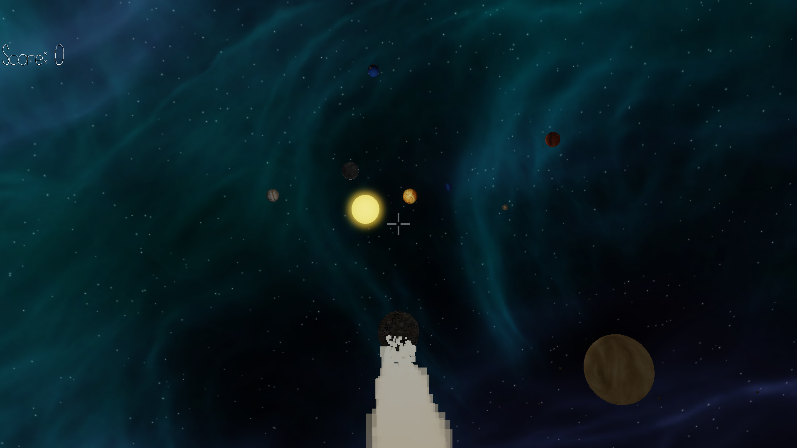

# PlayComet

Author: Yunfei Cheng, Zizhuo Lin, Xiaoqiao Xu, Zhengyang Xia

Design: A romantic comet wanders in the vast universe, meeting and courting different planets in its way :D

Screen Shot:

How To Play:

Reach as many planets as you can before crashing into the Sun. Press wasd to move around and qe to tilt. Press the left mouse button to shoot (only in certain tasks).

Sources: 
Sound Effect:
BGM: https://freepd.com/ Mana Two Part 2
Comet hit: https://freesound.org/people/HxcPotato/sounds/160883/
Laser: https://freesound.org/people/staticpony1/sounds/473938/

Texture:
Planet textures: https://www.solarsystemscope.com/textures/
comet & asteriods: https://texturehaven.com/textures/

Some code from: https://github.com/SebLague/Solar-System

This game was built with [NEST](NEST.md).

